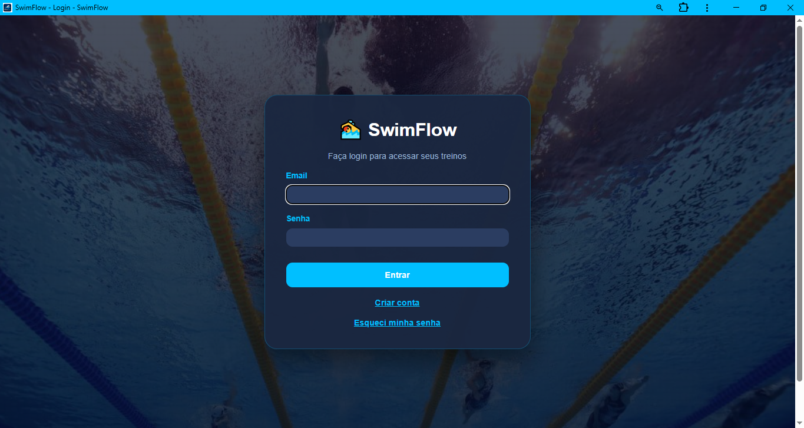
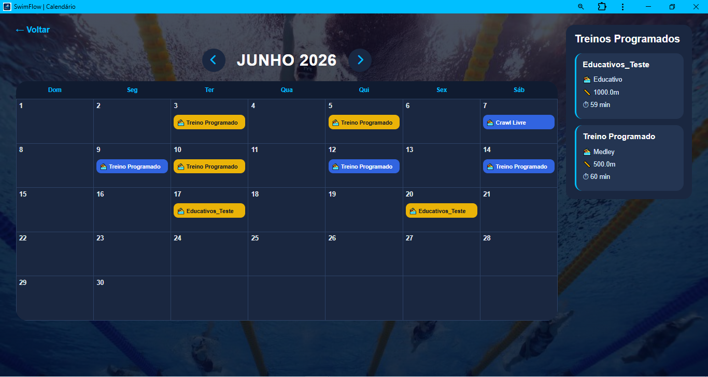
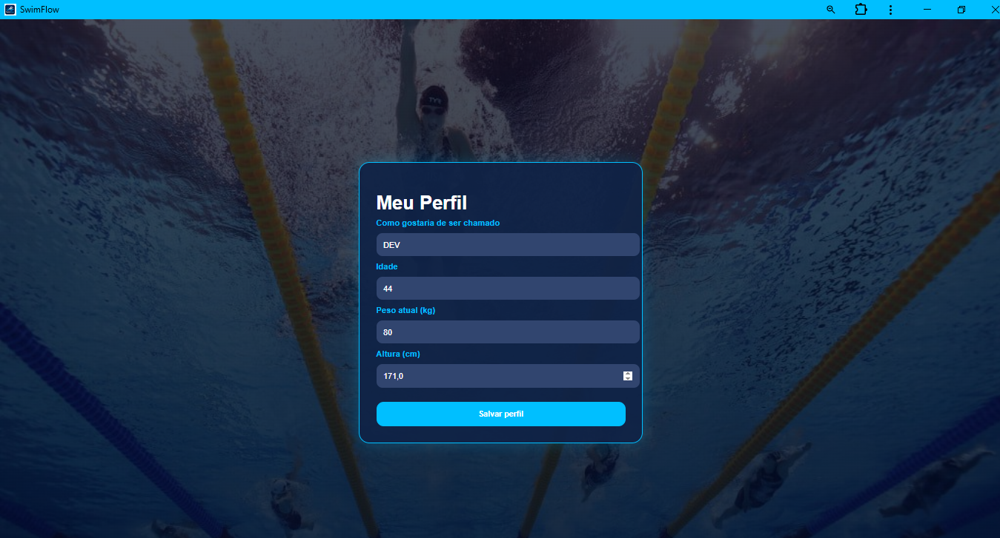
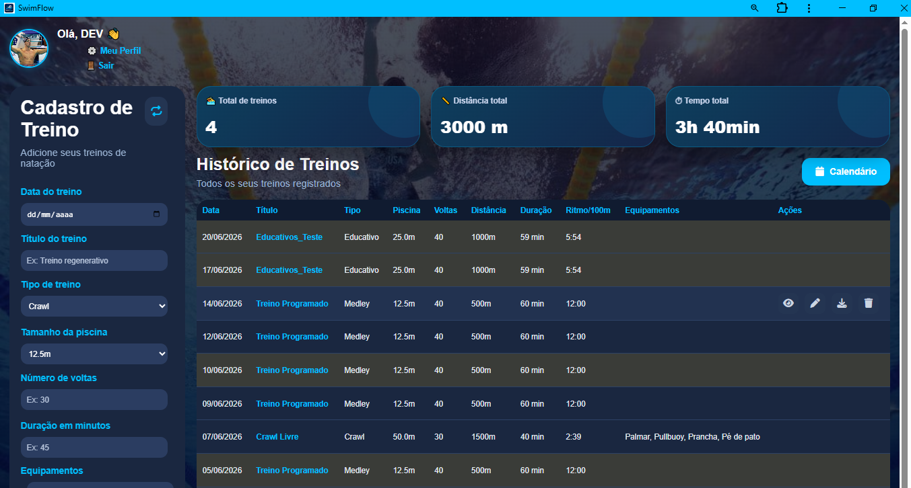

# 🏊 SwimFlow

Sistema web para gerenciamento e acompanhamento de treinos de natação desenvolvido com Python, Flask e MySQL.

O SwimFlow permite registrar, organizar e acompanhar treinos de natação, fornecendo métricas de desempenho, histórico individual, planejamento de treinos futuros e exportação para dispositivos esportivos.

---

## 🚀 Destaques

* Sistema completo de autenticação de usuários
* Dashboard com métricas de desempenho
* Calendário para planejamento de treinos
* Histórico completo de atividades
* Exportação de treinos em formato TCX
* Compatível com Garmin Connect
* Aplicativo instalável via PWA
* Interface responsiva para desktop e dispositivos móveis

---

## 📷 Capturas de Tela

### 🏠 Tela Inicial



### 📅 Calendário de Treinos



### 👤 Perfil do Usuário



### 📊 Dashboard e Histórico



---

## ✨ Funcionalidades

### 👤 Usuários

* Cadastro de usuários
* Login seguro com senha criptografada
* Recuperação de senha
* Perfil personalizado
* Nome de exibição
* Registro de idade, peso e altura

### 🏊 Treinos

* Cadastro de treinos
* Edição de treinos
* Exclusão de treinos
* Histórico completo
* Programação de treinos futuros
* Treinos modelo reutilizáveis
* Marcação de treinos realizados
* Cálculo automático de distância
* Cálculo automático de pace

### 📅 Calendário

* Visualização mensal dos treinos
* Planejamento de sessões futuras
* Reagendamento de treinos
* Organização visual dos treinos programados

### 📊 Dashboard

* Total de treinos realizados
* Distância total nadada
* Tempo total de treino
* Histórico detalhado de atividades

### 📤 Exportação

* Exportação em formato TCX
* Compatível com Garmin Connect e outros aplicativos esportivos

### 📱 Progressive Web App (PWA)

* Instalação em celulares Android
* Instalação em computadores
* Experiência semelhante a aplicativo nativo

---

## 🛠️ Tecnologias Utilizadas

* Python
* Flask
* MySQL
* HTML5
* CSS3
* JavaScript
* Progressive Web App (PWA)

---

## 📂 Estrutura do Projeto

```text
swimflow-app/
│
├── app.py
├── database/
├── modelos/
├── static/
├── templates/
├── docs/
├── requirements.txt
├── manifest.json
└── service-worker.js
```

---

## 🚀 Como Executar Localmente

### 1. Clonar o repositório

```bash
git clone https://github.com/Simiao-png/swimflow-app.git
```

### 2. Acessar a pasta

```bash
cd swimflow-app
```

### 3. Instalar dependências

```bash
pip install -r requirements.txt
```

### 4. Configurar o banco de dados

Crie um banco MySQL e ajuste as configurações de conexão em:

```text
database/connection.py
```

### 5. Executar a aplicação

```bash
python app.py
```

---

## 🎯 Próximas Melhorias

* Cálculo estimado de calorias gastas
* Cálculo de IMC
* Evolução de peso do atleta
* Relatórios avançados
* Dashboard com gráficos
* Estatísticas por período

---

## 👨‍💻 Autor

**Silas Simião**

Projeto desenvolvido para gerenciamento e acompanhamento de treinos de natação utilizando Python, Flask, MySQL e tecnologias web modernas.
